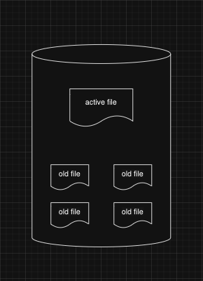
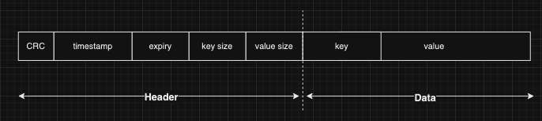
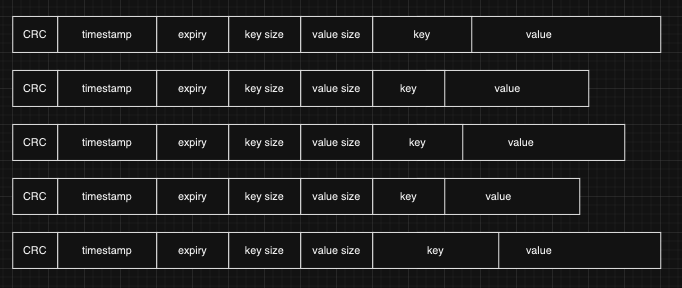
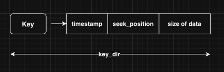
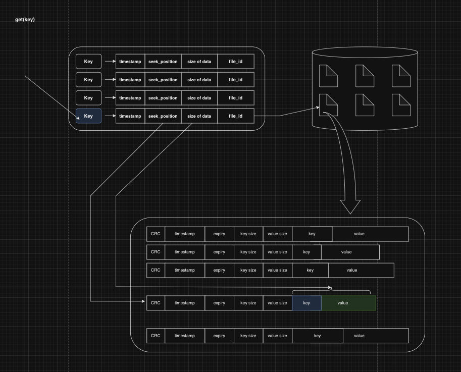

# pyk

**pyk** is a python implementation of [Bitcask](https://riak.com/assets/bitcask-intro.pdf)- a disk-based, log-structured persistent Key-Value store. Data is written sequentially to an *append-only* log-file and there will be pointers for each *key* pointing to the exact *position* in the log-file. 

## Features
- simple design
- low latency read/write because of *single O(1) disk seek* and *append-only* writes
- high write throughput because of *append-only* writes
- ability to handle data larger than size of RAM

## Design 
### Datafiles
There can be multiple datafiles each with specific size, but there will be only one active data file where the write happens.




### Data Format
In each of the data files, data is written in append-only manner. Each *data write* is formatted in a specific way consisting of a header and the actual data (KV pair). 

 

Header has the following fields,
- CRC (cyclic redundency check) for data integrity
- timestamp of when the KV pair is written
- expirey of KV pair (TTL)
- key & value size

Key and Value sizes can vary for each pair of items. When multiple KV pairs are written into the files, they look something like this,

 

### Reading
**pyk** maintains a dictionary called - ***key_dir*** which store the key and its position in the data file. 



When `get(key)` is called, **pyk** looks for `key` in ***key_dir*** to find the position of key in datafile. Then the data is read directly from the datafile with a single seek.



## Usage
for example usage refer [example.py](./example.py)
```py
from src.disk_store import KVStore

# create a KVStore
kvs = KVStore()

# set a key
kvs.set("foo", "barbarbar")

# get key
print(kvs.get("foo"))

kvs.close()
```

## Supported Operations
- set (with TTL support)- `set(key, value [, expirey])`
- get - `get(key)`
- delete - `delete(key)`

#### TO-DO

- list
- merge and hintfiles
- mulitple KVStores

## References
- [Bitcask paper](https://riak.com/assets/bitcask-intro.pdf)
- [Bitcask - A Log-Structured fast KV store](https://arpitbhayani.me/blogs/bitcask/) by [Arpit Bhayani](https://twitter.com/arpit_bhayani)
- [CaskDB](https://github.com/avinassh/py-caskdb/tree/master)- simple python implementation by [@iavins](https://x.com/iavins), **pyk** is based on this with more features added.
- [barrel-db](https://github.com/mr-karan/barreldb)- a more complete implementation of Bitcask paper in Golang by [@mrkaran_)](https://twitter.com/mrkaran_)